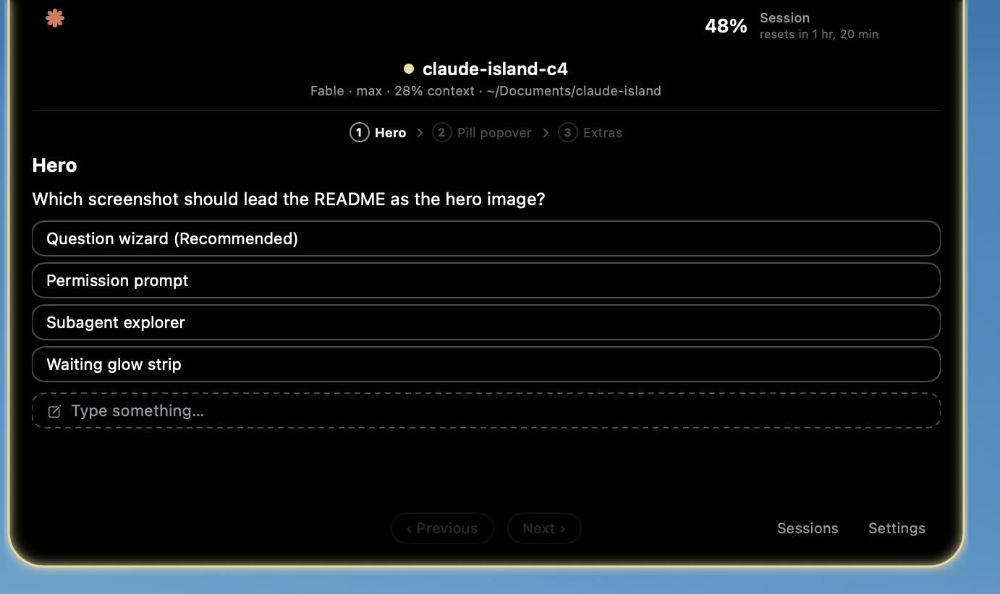
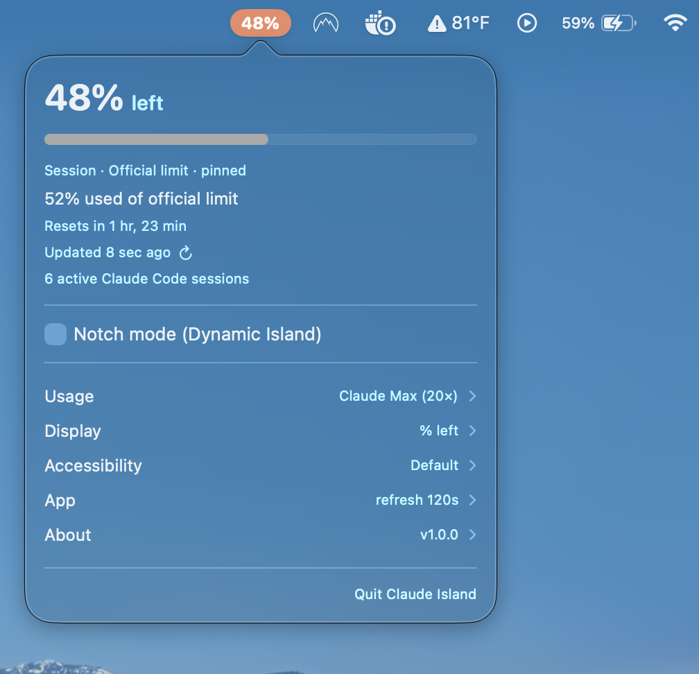
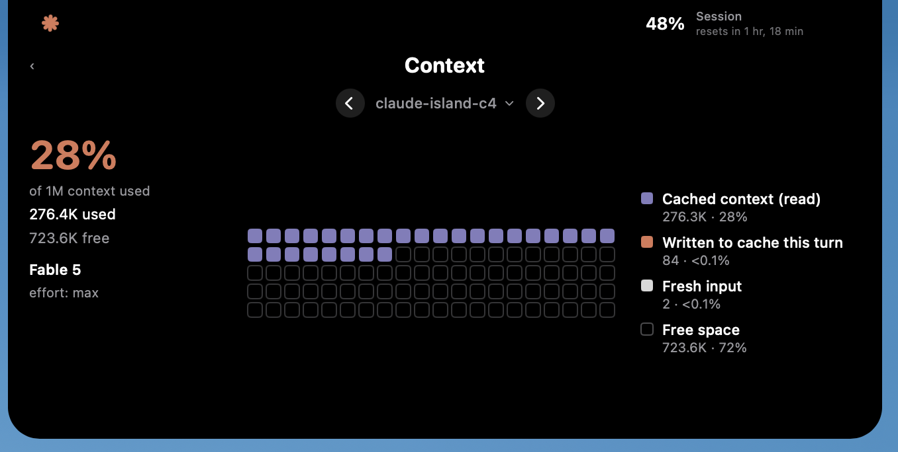
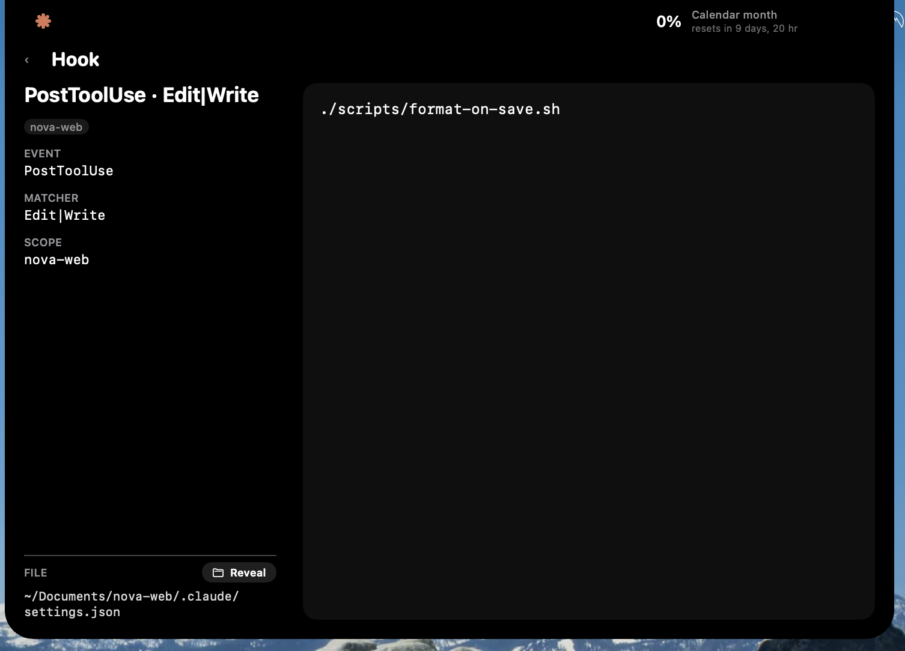
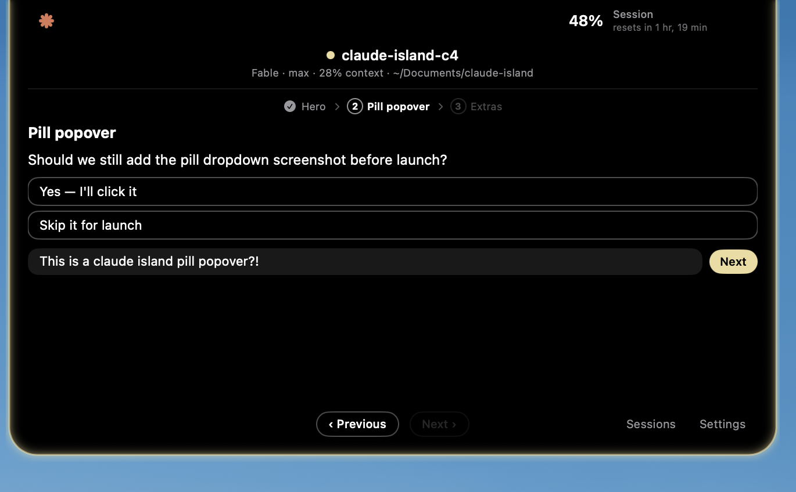
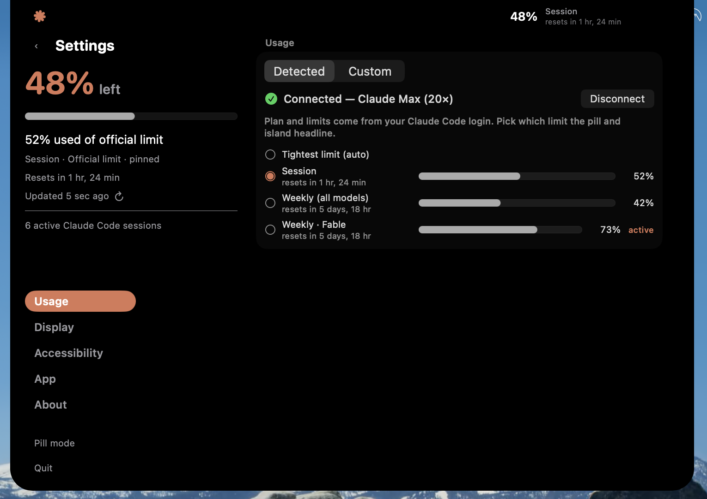
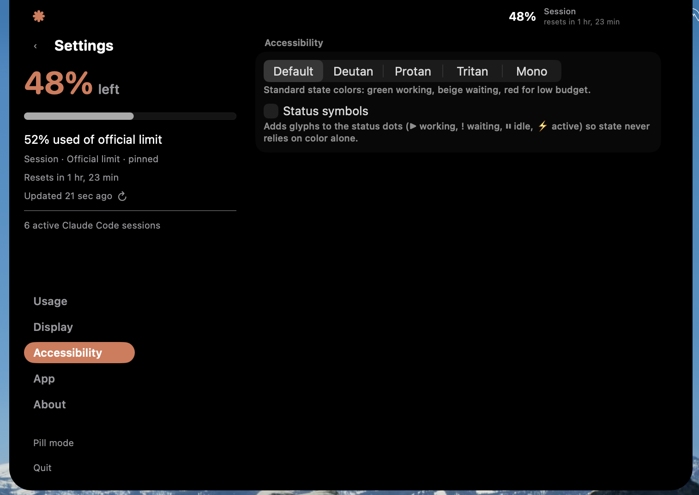

<div align="center">

# Claude Island

**A Dynamic Island for Claude Code, living in your MacBook's notch.**

Glanceable usage limits, live session status, and Claude's questions —
answerable right from the notch, without switching back to the terminal.

[](#getting-started)
[](Package.swift)
[](Package.swift)
[](LICENSE)



</div>

## Why

You kick off a long Claude Code run and switch to something else. Ten minutes later
you're wondering: *is it still working? Did it hit a permission prompt right after I
looked away? How much of my 5-hour window is left?*

Claude Island keeps those answers in your eyeline. It wraps the camera notch (or sits
as a tiny menu-bar pill), watches every Claude Code session running on your Mac, and
comes alive at exactly the moments Claude needs you.

## Highlights

- **Usage at a glance** — the % of your Claude plan that's left, read from Anthropic's
  own usage endpoint with your existing login, or computed locally from transcripts.
- **Live status you can feel** — the Claude asterisk spins while a session works, takes
  a Dock-style double bounce with an orange trail around the island when a response
  lands, and the border breathes a warm glow when Claude is waiting on *you*.
- **Answer from the notch** — a question, a plan approval, a permission prompt: the
  island auto-expands with the exact content the moment it appears. Click an option
  chip, toggle multi-selects, type a free-text answer, or step through multi-question
  wizards — without ever raising the terminal.
- **Session explorer** — carousel through every running session: model, reasoning
  effort, context-window usage, working directory, and its Skills, Hooks, and
  Subagents — with live *active now* markers for skills used this turn and subagents
  currently running.
- **Accessible by design** — Okabe-Ito–derived palettes for deuteranopia, protanopia,
  tritanopia, and monochromacy, plus optional status symbols so no state ever relies
  on color alone.
- **Private by design** — no telemetry, no third-party dependencies, nothing leaves
  your Mac except one optional call to Anthropic authenticated with your own token.
  [Details below.](#privacy-honestly)

## Two ways to wear it

### The pill



The default: a rounded orange pill in the menu bar with your percent left. It turns
red when you're under 10%. Click it for the full breakdown — active limits, reset
times, sessions — and settings.

### The island


Flip on notch mode and the pill becomes an island around the camera housing: Claude
asterisk on the left wing, percent on the right, pure black in between — glowing warm
when a session is waiting on you. Click it and the island expands into the full
panel — sessions, capabilities, context, settings:



Every skill, hook, and subagent in the explorer opens a detail page — scope, full
description, the exact command or source file, and a Reveal button:



No notch? It still works — the island renders as a compact overlay at the top edge
of any display.

## When Claude needs you

This is the part that changes how you work. When a session starts **waiting** — an
`AskUserQuestion`, a plan approval, a permission dialog — the island lights up,
auto-expands, and shows the *actual* prompt: the question with its options, the plan
excerpt, or the command a permission is asking about.

Then you answer it right there:

- **Option chips** for single-select questions — one click and it's submitted.
- **Checkboxes + one send** for multi-selects.
- **A "Type something…" row** on every question for free-text answers.
- **A step-through wizard** with a breadcrumb when Claude asks several questions at
  once — jump back and revise any answer before sending.



Your click races the terminal dialog — whichever side answers first wins, and the
other side resolves cleanly. Auto-expand and collapse-on-click-away are both
toggleable in Settings if you'd rather summon the island yourself.

This works through two separate opt-in toggles — **Session insights** (read-only
statusline + prompt capture) and **Click-to-answer** (the answering half) — which
install a small
set of Claude Code hooks (running sessions pick them up without a restart — and
[here's exactly what it touches](#privacy-honestly)).

## How the % is computed

Three switchable sources, because not every account exposes the same data:

| Source | How it works |
|---|---|
| **Official API** | Reads your real limit utilization — session window, weekly windows, per-model limits, even enterprise credit balances — from Anthropic's OAuth usage endpoint, using the Claude Code token already in your keychain. Exact: matches `/usage` in Claude Code. Your plan (Pro / Max 5× / Max 20×) is auto-detected from the same credential. |
| **Cached usage (tokens)** | Sums the per-response `usage` blocks Claude Code writes to `~/.claude/projects/**/*.jsonl` against a token budget. Cache tokens are price-weighted by default (cache reads ×0.1, writes ×1.25–2) so cheap cache reads don't swamp the number — toggleable. |
| **Cost estimate** | Converts those tokens to dollars with a per-model, cache-aware pricing table, times an optional multiplier for discounted enterprise rates, against a dollar budget. |

Windows: rolling **5-hour** and **weekly** (local approximations — the Official API
source is the exact one), or **calendar month** for usage-based billing. Plan presets
ship with editable budget estimates; pick Custom to set your own.

## Getting started

You'll need macOS 14+, the Xcode command line tools (Swift 5.9+), and
[Claude Code](https://code.claude.com) — the thing being watched.

```sh
git clone https://github.com/Alex-Nikita/claude-island.git
cd claude-island
make install   # builds, installs to /Applications, launches
```

That's it — no dependencies to resolve, no signing setup, nothing to configure.
The app runs as a background agent (no Dock icon), detached from the terminal —
close every window and the island stays up. Quit it from the pill dropdown or the
island's bottom rail.

Installed this way it behaves like any Mac app: relaunch it from Spotlight, add it
to Login Items (System Settings → General → Login Items) so it starts with your
Mac, or from any shell:

```sh
alias island='open -a "Claude Island"'
```

Hacking on it instead? `make run` builds and launches straight from the checkout
without touching /Applications, and `make test` runs the suite.

> [!NOTE]
> No signing setup needed — a fresh clone builds ad-hoc signed with zero prompts.
> The Official API source reads the `Claude Code-credentials` keychain item, and only
> after you press **Connect Claude account…** in settings; launching the app never
> touches the keychain. Ad-hoc approvals reset per rebuild, so if you rebuild often,
> [docs/SIGNING.md](docs/SIGNING.md) shows how to make one approval stick. Replacing
> an existing install can also raise a one-time **App Management** approval for your
> terminal — macOS guards apps inside /Applications.

## Compatibility

|  | Supported | Tested |
|---|---|---|
| **macOS** | 14 (Sonoma) and newer | 26.5 |
| **Mac** | Apple silicon & Intel, notch optional | MacBook Pro 16″ (Apple silicon, notch) |
| **Claude Code** | 2.x | 2.1.x (2.1.201 – 2.1.216) |
| **Displays** | Built-in notch, notchless, external | Built-in notch display |

Intel Macs and notchless/external displays *should* work — the island falls back to a
compact top-edge overlay when there's no camera housing — but haven't had hands-on
testing yet. If you run one of those combos, an issue confirming it works (or doesn't)
makes this table better for everyone.

Features degrade gracefully with older Claude Code versions rather than breaking:

- **Usage % from transcripts** works with any version that writes `usage` blocks to
  `~/.claude/projects`.
- **Official API usage** just needs a logged-in Claude Code (its keychain credential).
- **Live session status** needs Claude Code's session registry
  (`~/.claude/sessions/`) — without it the meter still works, you just lose the
  status animations and session explorer.
- **Session insights & click-to-answer** rely on 2.1-era hooks
  (`PermissionRequest`); on older versions these toggles simply have no effect.
  Click-to-answer also needs `python3` on PATH (it ships with the Xcode command
  line tools) and quietly stands down without it.

## Privacy, honestly

Everything stays on your Mac. In detail:

- **What it reads:** the Claude Code session registry (`~/.claude/sessions/`),
  transcripts (`~/.claude/projects/**/*.jsonl`), your skills/agents/hooks configs
  (for the explorer), and — only if you use the Official API source — the Claude Code
  OAuth token from your keychain.
- **What it sends:** one `GET https://api.anthropic.com/api/oauth/usage` with that
  token, cached for 60 seconds. That's the entire network footprint. The endpoint is
  undocumented and throttles unknown clients, so the app identifies with a
  Claude-Code-compatible `User-Agent` that also names itself:
  `claude-code/2.1 (Claude Island)`. If Anthropic changes or blocks the endpoint,
  the app silently falls back to local token counting.
- **What it never does:** analytics, crash reporting, update pings, third-party
  servers, third-party code. The dependency list is empty by design.

**The hooks are two separate opt-ins.** **Session insights** installs read-only
capture scripts under `~/.claude/island/` — the statusline and event capture that
fill the Context page and show exact prompts; it records, and never answers.
**Click-to-answer** separately installs the permission answerer that lets an island
click race the terminal dialog. Before touching `~/.claude/settings.json` the app
backs it up to `~/.claude/island/settings-backup.json`, refuses to modify a settings
file it can't parse (a broken file is never clobbered), and toggling off removes
every hook and script cleanly. Captured events are owner-only on disk and pruned
after a week.

**On a managed or enterprise seat?** Your org may run permission policies precisely
so a human reviews each sensitive tool call — check policy before enabling
click-to-answer (everything else works fully without it). The complete threat
model, including what a local attacker could and couldn't gain, lives in
[SECURITY.md](SECURITY.md).

## Debug flags

Launch with environment variables to poke at specific states:
`CI_START_EXPANDED=1` (open pre-expanded), `CI_TEST_ATTENTION=1` (force the
waiting glow), `CI_TEST_PULSE=1` (fire the completion animation),
`CI_TEST_SETTINGS=1` (straight to settings), `CI_DEBUG_ATTENTION=1`
(log attention decisions).

## FAQ

**Is this an official Anthropic app?**
No. Claude Island is an independent community project — see the disclaimer below.

**My Mac has no notch.**
Fine! The island draws as a compact top-edge overlay on notchless displays, and pill
mode is always there.

**Does it watch claude.ai or the Claude desktop app?**
No — it watches **Claude Code** (the CLI/terminal agent), via the session files it
keeps under `~/.claude`.

**Can answering from the island conflict with the terminal?**
No. Claude Code races its dialog against permission hooks by design — first answer
wins, the loser exits quietly. If you answer in the terminal, the island notices and
stands down.

## Contributing

Issues and PRs are welcome. `make test` runs the suite — the parsing, usage math,
answer wizard, hook-capture state machine, and even the installed shell/python
scripts are covered, so you'll know quickly if something regressed.

## More screens

<p>


</p>

## Acknowledgements

- **[vibe-notch](https://github.com/farouqaldori/vibe-notch)** (Apache-2.0) — studied
  as a reference for positioning a window over the notch. The implementation here was
  written from scratch and solves the window level, click handling, and geometry
  differently, but seeing a working approach first was genuinely helpful.
- **[The Boring Notch](https://github.com/TheBoredTeam/boring.notch)** — the
  island look-and-feel inspiration.

## Disclaimer & license

Claude Island is an unofficial project. It is not affiliated with, endorsed by, or
sponsored by Anthropic. "Claude" is a trademark of Anthropic, PBC. The usage endpoint
it reads is undocumented and may change or disappear at any time.

Licensed under [Apache 2.0](LICENSE) © 2026 Alexandros Nikita.
